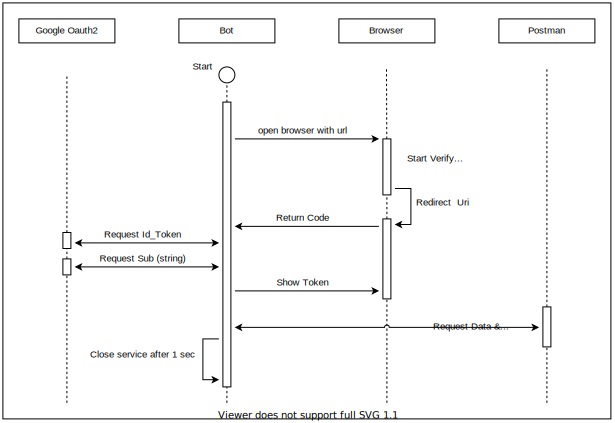

# Synopsis
- Purpose : Get google oauth2 token by command line
    1. Open browser to authenticate
    2. Get `Sub` and `Id token`
- Google Oauth2 DOC : https://developers.google.com/google-ads/api/docs/concepts/curl-example

# prerequisite
- https://developers.google.com/identity/protocols/oauth2
- Follow google doc to get `client_id`, `client_secret`, `redirect_uri`
    - Make sure the reditect_uri have localhost setting, `http://localhost:8080/.....`

# Run
```
id="......." &&\
secret="......." &&\
uri="http://localhost:8080/....." &&\
go run main.go -id=$id -secret=$secret -redirectUri=$uri
```
## Command Line result


## Browser result


# Use it to set environment within Postman

## Pre-request Script
```
pm.sendRequest('http://localhost:8080/postman', (error, response) => {
  if (error) {
    console.log(error);
  } else {
    console.log(response.json().sub);
    console.log(response.json().id_token);
    //
    pm.environment.set("google_oauth_sub", response.json().sub);
    pm.environment.set("google_oauth_id_token", response.json().id_token);
  }
});
```

## Use environments
- {{google_oauth_sub}}
- {{google_oauth_id_token}}